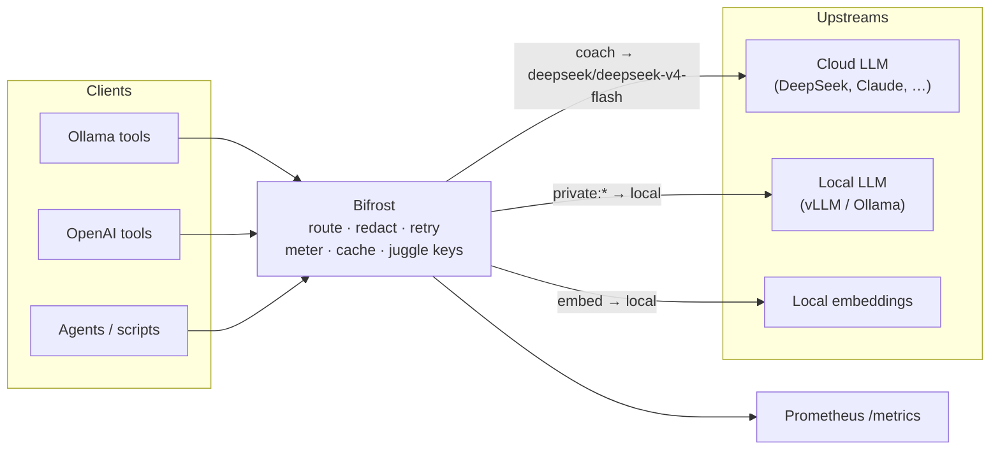

# Bifrost

**One endpoint for every LLM you run.** Bifrost is an Ollama-compatible *and*
OpenAI-compatible gateway that fronts all your AI backends — cloud and local —
behind a single URL, and layers routing, privacy, resilience, metering, and
caching on top. Point any tool at it and it just works.

Named for the Norse rainbow bridge: it carries requests from Ollama/OpenAI
clients (Midgard) to the model backends (Asgard).



## Why Bifrost

- **Drop-in replacement.** Point any tool that wants an Ollama or OpenAI URL at
  Bifrost — no local GPU, no model downloads, no per-client config.
- **One door, many backends.** Swap DeepSeek for vLLM, add Claude or Gemini,
  without touching a single client. Unknown model names route to a default
  backend unchanged.
- **Private by default.** PII is scrubbed from cloud-bound traffic, and
  `private:*` models refuse to leave the LAN.
- **Resilient under you.** Retries, transparent failover, circuit breakers, and
  multi-key rotation absorb backend failures — the client sees one slow success,
  never an internal failure.
- **Observable.** Prometheus `/metrics` with accurate token, cost, and latency
  accounting, plus a spend ledger and budgets.
- **Tiny.** A single ~10 MB static Go binary, stdlib-only, near-zero state.

## Quick start

```bash
docker run -d --name bifrost -p 11434:11434 \
  -e UPSTREAM_API_KEY=sk-... \
  ghcr.io/stevengann/bifrost:latest
```

Then point any Ollama/OpenAI client at `http://<host>:11434`. That's the whole
pitch — one command, and every tool that speaks the model APIs now talks to your
whole fleet through Bifrost.

## Features

- **Routing** — map client model names to any backend (`coach`, `private:*`,
  `embed`). See [Configuration → Multi-backend](docs/CONFIGURATION.md#multi-backend-recommended).
- **Resilience** — retries, failover chains, circuit breakers, and a health
  poller. See [Architecture → Resilience](docs/ARCHITECTURE.md#resilience).
- **Key pool** — dump every API key you own and let Bifrost juggle them:
  weighted round-robin with transparent rotation on rate-limits. See
  [Architecture → Key pool](docs/ARCHITECTURE.md#key-pool).
- **Privacy** — PII redaction and LAN-only `private:*` routing. See
  [Architecture → Privacy](docs/ARCHITECTURE.md#privacy).
- **Caching** — exact-match plus opt-in semantic (embedding) caching. See
  [Architecture → Caching](docs/ARCHITECTURE.md#caching).
- **Governance** — budgets, rate limits, per-app auth, spend ledger. See
  [Configuration](docs/CONFIGURATION.md).
- **Model catalog** — `/v1/models` returns privacy tier, backend, and pricing.
- **Embeddings** — Ollama and OpenAI embedding endpoints.
- **Metrics** — Prometheus `/metrics` plus a live dashboard.

## Documentation

- **[Architecture](docs/ARCHITECTURE.md)** — request lifecycle, routing,
  resilience, key pool, privacy, observability, and the code layout.
- **[Configuration](docs/CONFIGURATION.md)** — the full environment reference.
- **[Contributing](docs/CONTRIBUTING.md)** — build, test, and extend.
- **[Roadmap](docs/ROADMAP.md)** — where it's heading.

## License

MIT. See [LICENSE](LICENSE).
