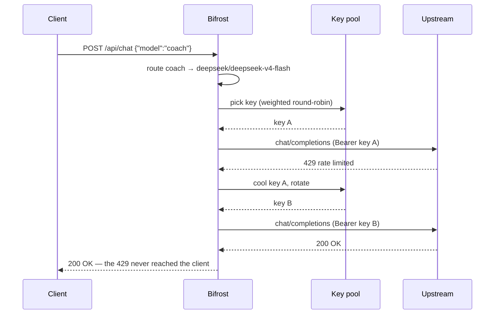
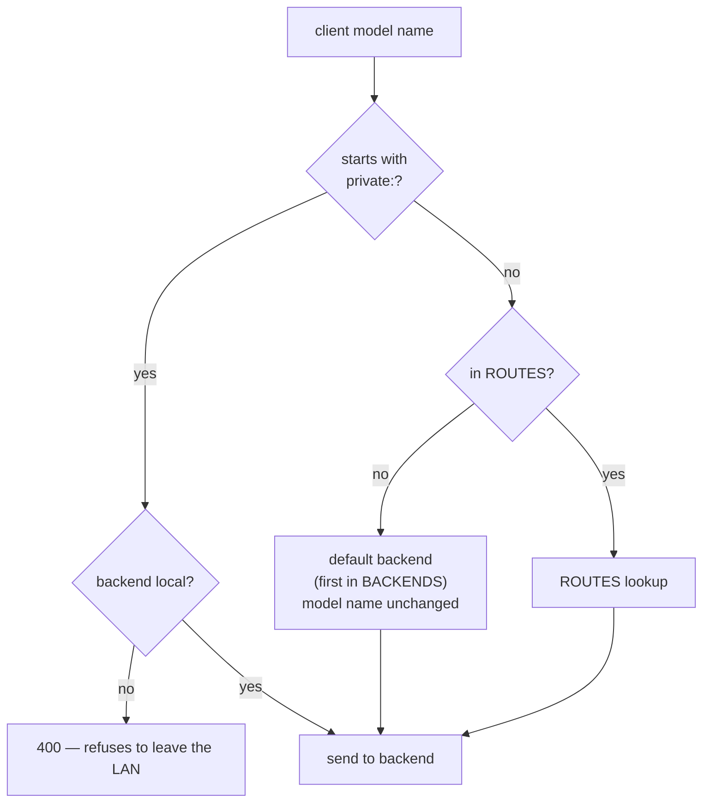
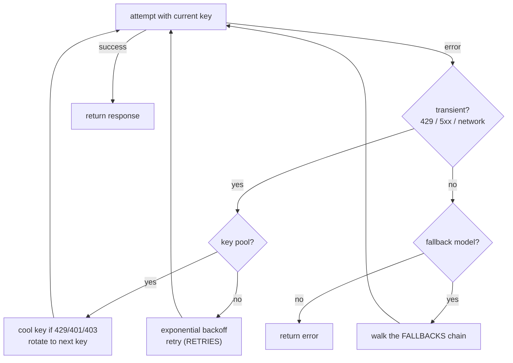
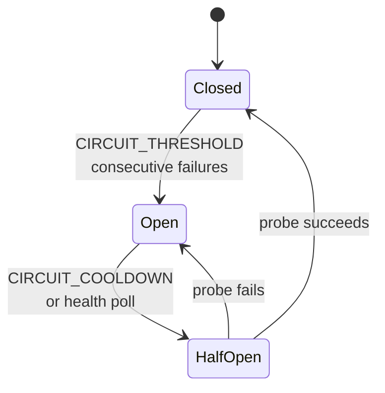
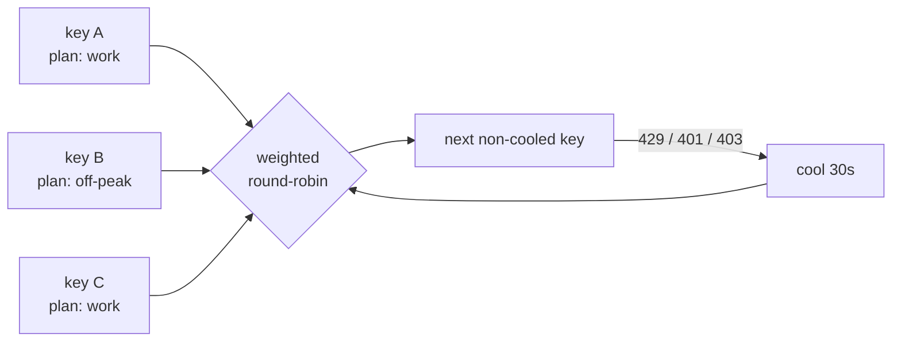

# Architecture

Bifrost is a single Go binary that sits between model clients and model
backends. It is **stateless by design**: every behavior is driven by environment
config (`BACKENDS`, `ROUTES`, …). The only state it keeps is an optional
append-only spend ledger (`LEDGER_FILE`) and in-memory caches — which are
deliberately never persisted, because cached responses can echo request PII.

## Request lifecycle

Every request — chat, generate, embeddings, or the `/v1` pass-through — funnels
through the same pipeline:

## Routing

Client-facing model names are mapped to `backend/upstream-model` pairs.

- `ROUTES` is a JSON map of `"client-model": "backend/upstream-model"`.
- The **first** backend in `BACKENDS` is the default: unknown model names route
  to it unchanged.
- `private:*` is a hard privacy boundary — it refuses to route to a non-local
  backend rather than silently exfiltrate data.

## Resilience

Failures are absorbed transparently. The client sees one slow success, never an
internal backend failure.

Streaming is the one exception: retries and failover happen only **up to the
first byte flushed**. Once a stream starts it is committed and cannot be
replayed, so a mid-stream failure is the only thing a client can ever observe.

### Circuit breaker

Each backend also gets a circuit breaker, so a downed backend fails fast (or
fails over instantly) instead of hanging every request.

A background **health poller** probes every backend on `HEALTH_INTERVAL` and
pre-opens the circuit while a backend is unreachable — absence is *noticed*
before any request discovers it. Local backends use a short 3s dial timeout so a
powered-off worker fails over in seconds, not 30s.

## Key pool

A backend can hold **many** keys instead of one — dump every API key you own
(different billing plans, rate-limit buckets) and let Bifrost juggle them:

- **Weighted round-robin** spreads load across keys; `weight` (default `1`)
  spends one key more than another.
- A rate-limited or rejected key (`429`/`401`/`403`) is **cooled** for ~30s
  while the retry rotates to the next key — before backend failover ever
  applies. Server errors (`5xx`) and network failures are *not* key problems, so
  they don't cool a key.
- Keys are labeled with `id` and `plan` for observability. With no key pool,
  the single `api_key_env` key is used unchanged.
- Tracked as `bifrost_key_rotations_total{backend}`.

## Privacy

- **PII redaction.** Requests bound for a *cloud* backend (base URL not
  loopback / RFC1918 / `.lab`) have obvious identifiers scrubbed before they
  leave the LAN: emails, phones, card numbers, SSNs, IPs, API/SSH keys, PEM
  private keys.
- **`private:*` models.** Refuse to route to a non-local backend — `400` rather
  than silently sending data to the cloud.
- **Local auto-detection.** Loopback, RFC1918, and `.lab`/`.local` backends are
  treated as local (never redacted); override with `"local": true`/`false`.

## Caching

- **Exact-match** (default): identical non-streaming requests are served from an
  in-memory LRU with TTL, skipping the upstream call entirely — zero cost, zero
  latency. Never persisted.
- **Semantic** (opt-in `SEMANTIC_CACHE=true`): the prompt is embedded via the
  `EMBED_MODEL` route and a near-neighbor cached response is served above
  `SEMANTIC_THRESHOLD` (cosine similarity). A reworded question hits cache
  instead of upstream. Degrades gracefully — if the embedding backend is down,
  requests simply skip semantic caching.

## Observability

`GET /metrics` exposes Prometheus metrics: requests, tokens, cost, errors, and
latency by model and app; plus cache hits/misses, semantic-cache hits/misses,
circuit trips/open state, backend health, and key rotations. Token counts are
**accurate, not estimated** — Bifrost injects `stream_options.include_usage` and
reads the usage block from the final streaming chunk.

Cost is priced at DeepSeek's official cache-miss rates, doubled during peak
hours; override or add models via `PRICING`.

## Code layout

| File | Responsibility |
|------|----------------|
| `main.go` | config loading, routes, wiring |
| `resilience.go` | `resolve()` retry/failover loop |
| `circuit.go` | circuit breaker + `do()` HTTP call |
| `keys.go` | key-pool ring, cooldown, rotation |
| `upstream.go` | Ollama/OpenAI request shaping |
| `ollama.go` | Ollama API handlers |
| `openai.go` | OpenAI API handlers + `/v1` pass-through |
| `catalog.go` | model catalog (`/v1/models`) |
| `cache.go` | exact-match LRU cache |
| `semantic.go` | semantic (embedding) cache |
| `govern.go` | budgets, rate limits, spend ledger |
| `health.go` | backend health poller |
| `redact.go` | PII redaction |
| `metrics.go` | Prometheus metrics |
| `dashboard.go` | live status dashboard |
| `embeddings.go` | embeddings handlers |
